<div align="center">


<br><br>

<a href="https://linkedin.com/in/harsh2003"></a>&nbsp;
<a href="mailto:harshrastogi0603@gmail.com"></a>&nbsp;
<a href="https://www.harshrastogi.tech"></a>&nbsp;
<a href="https://github.com/Harsh-Rastogi-03/carcode"></a>

</div>

<br>

I'm an **AI Product Engineer** who builds generative-AI products and autonomous agents, and takes them from idea to production. Today that means AI fashion imagery at **Modelia**, multi-agent systems at **SelfAgentic**, and a learning platform I delivered end to end for **GyanSathi**.

I care about the parts of AI products that rarely make the demo: correct billing, safe data pipelines, clean migrations, and agents that know when to hand over to a human.

<br>

<table>
<tr>
<td width="33%" valign="top" align="center">

### 🎨 [Modelia](https://modelia.ai)
**AI Product Engineer**

Generative-AI fashion imagery and video for e-commerce brands

</td>
<td width="33%" valign="top" align="center">

### 🤖 [SelfAgentic](https://selfagentic.in)
**Contributor**

Teams of autonomous AI agents that work inside your tools

</td>
<td width="33%" valign="top" align="center">

### 🎓 [GyanSathi](https://gyansathi.com)
**Delivered end to end**

A multilingual learning platform for 50,000+ learners

</td>
</tr>
</table>

<br>

## `Modelia` · AI Product Engineer

> [Modelia](https://modelia.ai) turns product photos into studio-quality fashion imagery and video with generative AI. I own systems across the product, from the billing engine under every generation to the agents that support customers.



<br><br>

<table>
<tr>
<td width="50%" valign="top">

### ⚡ Metering & billing for generative AI

Every image and video has a cost. I designed the engine that charges for it correctly.

- A **credit ledger and billing cycles in PostgreSQL**, built from transactional SQL functions, with an auditable pricing history kept by triggers
- **Stripe** webhooks drive each customer's cycle; plan changes and legacy-plan migrations are handled server-side
- **Generations pause at a zero balance and resume oldest-first**, with refunds when the engine fails, so users never pay for a failed job

`PostgreSQL` `Stripe` `TypeScript` `Event-driven`

</td>
<td width="50%" valign="top">

### 🎨 Modelia Studio platform

The workspace where brands turn their catalog into on-model photos, lifestyle shots and product video.

- A **catalog ingestion pipeline** for CSV, Google Drive and Dropbox, with an **SSRF-guarded fetcher** for untrusted image URLs
- **Catalog-to-generation orchestration**: one action seeds a studio project from any product
- **C2PA content credentials**, so generated media carries signed provenance

`TypeScript` `React` `Node.js` `PostgreSQL` `Azure`

</td>
</tr>
<tr>
<td width="50%" valign="top">

### 🤖 Autonomous support agents

AI agents answer customers on chat and email, with humans in control.

- An **email agent with human-in-the-loop handoff** that stops the moment a person takes over
- An **embeddable chat widget** with a host API, so the studio can open support in context
- A **live knowledge base** the team edits from an admin console, plus an operations dashboard for every agent

`Python` `LLMs` `SQLAlchemy` `Agents`

</td>
<td width="50%" valign="top">

### 🛍️ Shopify platform

Modelia's AI fashion tools (virtual try-on, consistent character, outfit generation) inside Shopify.

- Drove the **cutover to a unified database and session layer**, rolled out behind feature flags, with a bulk data-migration pipeline and runbook
- **Security hardening**: expiring offline tokens, a framework upgrade, and **41 dependency vulnerabilities resolved**
- **Containerized for Azure Container Apps**

`Remix` `Shopify` `TypeScript` `Docker` `Azure`

</td>
</tr>
</table>

<br>

## `SelfAgentic` · multi-agent platform

> [SelfAgentic](https://selfagentic.in): *"AI Agents That Work For You."* I contribute to a platform where teams of autonomous agents collaborate, remember context across runs, and take real actions in the tools a business already uses.

<table>
<tr>
<td width="50%" valign="top">

**What the platform does**

- **Multi-agent collaboration:** agents consult each other mid-run and chain into workflows
- **Persistent memory** across conversations and runs
- Real actions in **Slack, Google Workspace, LinkedIn, Instagram and Meta Ads**, plus web research

</td>
<td width="50%" valign="top">

**Built for production**

- **Per-agent tool permissions**, with **approval gates** on every outbound action
- No-code setup: describe an agent and its skills are suggested
- Ready-made specialists for lead intelligence, market research and SEO audits

</td>
</tr>
</table>

`Multi-agent` `LLMs` `Tool use` `Memory` `Human-in-the-loop`

<br>

## `GyanSathi` · delivered end to end

> [GyanSathi](https://gyansathi.com): *"Transforming Lives Since 2020."* I delivered the platform end to end: a multilingual learning system for students, professionals and companies training their teams.

| Area | What it covers |
|---|---|
| 📚 **Courses** | 500+ expert-led courses: course creation, video lessons and interactive quizzes |
| 🌐 **Multilingual LMS** | Self-paced learning in several languages, from anywhere |
| 📈 **Progress & analytics** | Learner progress tracking and real-time analytics dashboards |
| 🏅 **Certification** | Verified digital certificates with authenticity checks |
| 💬 **Community** | Discussion forums and community support |

<sub>Platform figures: 50,000+ active learners · 1,000+ instructors (per gyansathi.com)</sub>

<br>

## `journey`



<br><br>

## `open source`

<a href="https://github.com/Harsh-Rastogi-03/carcode"></a>

**[carcode](https://github.com/Harsh-Rastogi-03/carcode)**: a voice interface to Claude Code for the car. Say *"Hey Siri, Jarvis"* to review PRs, triage Slack and ship code changes hands-free over CarPlay. Under the hood, it keeps warm agent sessions, answers every turn within 8 seconds, holds long jobs in the background, and gates every outward action behind a spoken confirmation. It's tested, documented and set up in one command.

<br>

## `how I operate`

```diff
+ Own the outcome, not the ticket: product, platform and the billing underneath
+ Ship in small, reversible steps: 367 merged PRs this year, risky changes behind flags
+ Migrate without downtime: feature-flagged cutovers, data pipelines and written runbooks
+ Security is part of the feature: SSRF guards, token expiry, dependency hygiene
+ AI-native engineering: agents in my daily workflow, from code review to shipping by voice
```

<br>

## `stack`

<div align="center">


</div>

<br>

## `research & writing`

- 📚 **Book chapter:** *"6G Innovations: Healthcare & Medical Tech"*, Cambridge Scholars Publishing
- 📰 **Scopus-indexed paper:** *"Blockchain Technology in Bharat Judicial System"*

<br><br>

<div align="center">

### Building with generative AI? Let's talk.

<a href="https://linkedin.com/in/harsh2003"></a>&nbsp;&nbsp;
<a href="mailto:harshrastogi0603@gmail.com"></a>&nbsp;&nbsp;
<a href="https://www.harshrastogi.tech"></a>

</div>
