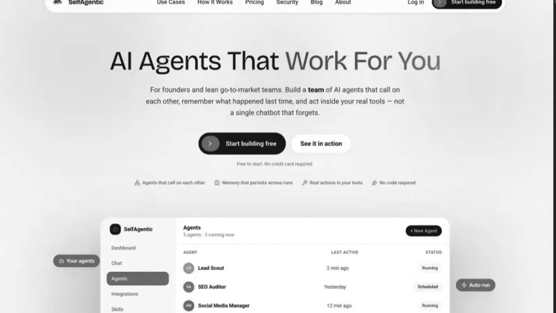
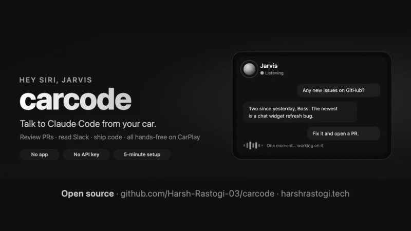
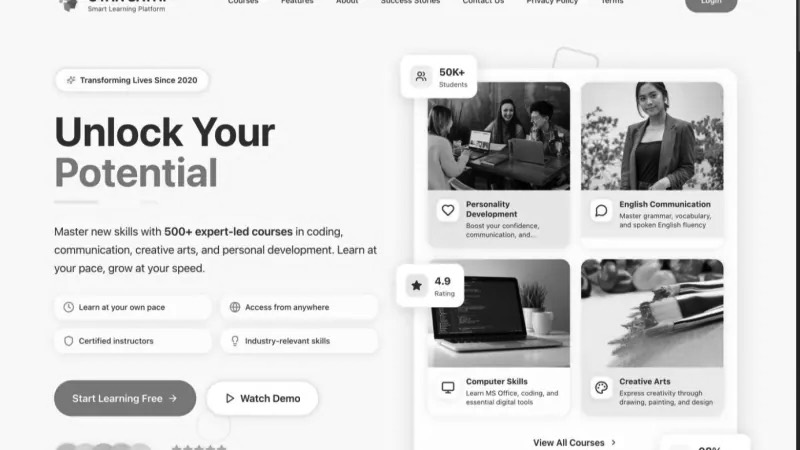

  <a href="https://www.harshrastogi.tech"><b>Portfolio</b></a>&nbsp;&nbsp;·&nbsp;&nbsp;<a href="https://www.harshrastogi.tech/projects">Work</a>&nbsp;&nbsp;·&nbsp;&nbsp;<a href="https://www.harshrastogi.tech/skills">Claude skills</a>&nbsp;&nbsp;·&nbsp;&nbsp;<a href="https://www.harshrastogi.tech/blog">Writing</a>&nbsp;&nbsp;·&nbsp;&nbsp;<a href="https://linkedin.com/in/harsh2003">LinkedIn</a>&nbsp;&nbsp;·&nbsp;&nbsp;<a href="mailto:harshrastogi0603@gmail.com">Email</a>

 

At **[Modelia](https://www.modelia.ai)** I'm the **AI Product Engineer and Business AI Head**. Modelia is a **complete AI solution for the fashion ecosystem**: DAM and PIM, catalogue management, product imagery and visual master generators, with **bulk generation** across an entire catalogue at once.

Every week I bring a new idea and build it **end to end**, from the first prototype to a feature people test in production. I also look for where AI can **grow the business** and **automate how our teams work**. Outside Modelia I'm a founding engineer at **[SelfAgentic](https://selfagentic.in)**, I own **[Tutively](https://tutively.com)** end to end, and I build open-source tools like **[carcode](https://github.com/Harsh-Rastogi-03/carcode)**.

 

## Experience

| | Role | What I built |
|---|---|---|
| **Modelia** · 2026 – now | AI Product Engineer & Business AI Head | The AI video pipeline, the metering engine under every generation, support agents and the Shopify app |
| **Modelia** · Jan – May 2026 | Full Stack Engineer | Unified and restructured the Shopify app (**95%+ fewer client escalations**); rebuilt the legacy platform in **35 days** |
| **Asynq** · 2025 | Full-Stack Developer | AI hiring automation: candidate scoring, bulk resume analysis and an autonomous AI interviewer |
| **Bharat Electronics** · 2024 | Defence internship | Interfaces for Harvester HCI and Indian Air Force projects (**75% less paperwork**) |

 

## Selected work

### [Modelia](https://www.harshrastogi.tech/projects/modelia-ai-platform) · the AI solution for the fashion ecosystem

<table>
<tr>
<td width="50%" valign="top">

**Metering and billing for generative AI.** A credit ledger and billing cycles in PostgreSQL, driven by Stripe webhooks. Generations pause at a zero balance, resume oldest-first and refund when the engine fails, so nobody pays for a failed job.

</td>
<td width="50%" valign="top">

**Studio platform.** Catalogue ingestion from CSV, Google Drive and Dropbox with an SSRF-guarded fetcher, one-click catalogue-to-generation, and C2PA content credentials on generated media.

</td>
</tr>
<tr>
<td width="50%" valign="top">

**Support agents.** An email agent with human-in-the-loop handoff, an embeddable chat widget, and a live knowledge base the team edits from an admin console.

</td>
<td width="50%" valign="top">

**Shopify app.** Built the Modelia Shopify app and moved it to a unified database and session layer behind feature flags, with expiring offline tokens, 41 dependency vulnerabilities resolved and containers on Azure.

</td>
</tr>
</table>

 

<table>
<tr>
<td width="50%" valign="top">

**[SelfAgentic](https://www.harshrastogi.tech/projects/selfagentic)** · Founding Engineer 
Teams of AI agents that call on each other, remember past runs and act inside Slack, Notion and email. In closed beta.
</td>
<td width="50%" valign="top">

**[Tutively](https://www.harshrastogi.tech/projects/tutively)** · End-to-end owner 
A smart school ERP with AI that analyses every student's performance and automates attendance and admin work.
</td>
</tr>
<tr>
<td width="50%" valign="top">

**[carcode](https://github.com/Harsh-Rastogi-03/carcode)** · Open source, MIT 
Say *"Hey Siri, Jarvis"* and Claude Code reviews PRs, reads Slack and ships changes while CarPlay reads the answer aloud. [How I built it →](https://www.harshrastogi.tech/blog/code-from-your-car-claude-code-carplay)
</td>
<td width="50%" valign="top">

**[GyanSathi](https://www.harshrastogi.tech/projects/gyansathi-lms)** · Built solo 
A learning platform for 5,000+ learners at CCS University: courses, exams, AI-based evaluation, certificates and payments.
</td>
</tr>
</table>

 

## The shelf

Things I've built for other people to use. Each skill installs into Claude Code with one command.

| | | |
|---|---|---|
| Claude skill | **[LLM Cost Audit](https://www.harshrastogi.tech/skills/llm-cost-audit)** | Find where your AI spend leaks: caching, model-tier mismatches and token waste |
| Claude skill | **[Agentic Error Recovery](https://www.harshrastogi.tech/skills/agentic-error-recovery)** | Harden AI agents with idempotency, loop guards, fallbacks and observability |
| Claude skill | **[AI Feature Rollout](https://www.harshrastogi.tech/skills/ai-feature-rollout)** | Ship AI features behind flags, guardrails and kill switches |
| Claude skill | **[Shopify App Review](https://www.harshrastogi.tech/skills/shopify-app-review)** | Catch App Store rejections before Shopify does |
| Claude skill | **[Prisma + Postgres Performance](https://www.harshrastogi.tech/skills/prisma-postgres-performance)** | Find the queries that will hurt at 10x traffic |
| Open source | **[carcode](https://github.com/Harsh-Rastogi-03/carcode)** | Code from your car with Claude Code |

 

## Writing

- [How I Code From My Car: Claude Code on Apple CarPlay With a Siri Shortcut](https://www.harshrastogi.tech/blog/code-from-your-car-claude-code-carplay)
- [Model Context Protocol (MCP): A Production Engineer's Complete Guide](https://www.harshrastogi.tech/blog/model-context-protocol-mcp-developer-guide-production)
- [Agentic AI in Production: Error Recovery, Observability and Scaling Patterns](https://www.harshrastogi.tech/blog/agentic-ai-error-recovery-observability-patterns)
- [All posts →](https://www.harshrastogi.tech/blog)

**Research:** book chapter *"6G Innovations: Healthcare & Medical Tech"* (Cambridge Scholars Publishing) and the Scopus-indexed paper *"Blockchain Technology in Bharat Judicial System"*.

 

## Stack

 

---

  <b>Building something with AI? Let's talk.</b>  
  &nbsp;
  &nbsp;
  

